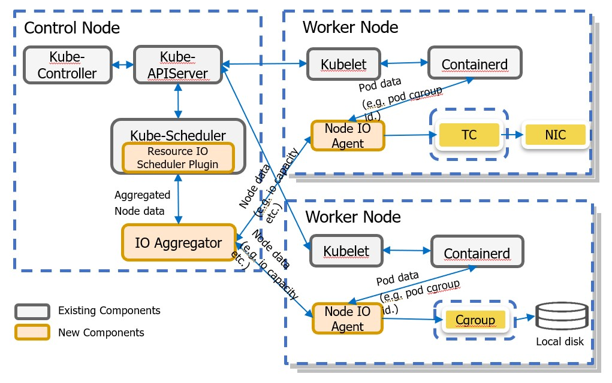

## DISCONTINUATION OF PROJECT. 

This project will no longer be maintained by Intel. 

Intel will not provide or guarantee development of or support for this project, including but not limited to, maintenance, bug fixes, new releases or updates. Patches to this project are no longer accepted by Intel. If you have an ongoing need to use this project, are interested in independently developing it, or would like to maintain patches for the community, please create your own fork of the project.

Contact: webadmin@linux.intel.com  
# IOIsolation

This repository hosts I/O Isolation and all of its build and dependent configuration files to deploy its components.

## Overall Architecture

Resource IO Aware Scheduling and Isolation solution is an end-to-end solution that provides guaranteed I/O resources for critical workloads through I/O aware scheduling and I/O resource boundary enforcement in cloud native environments, it includes below components:

* Resource IO Scheduler Plugin: Enable io aware scheduling for GA/BE workloads.
* IO Aggregator: Aggregate the node IO metrics reported by node agents and push the metrics updates to API Server. Synchronize pods' I/O requests to node agent.
* Node Agent: Report GA pool and BE pool available bandwidth and IO status aggregator. Calculate and then trigger GA/BE workload bandwidth boundary adjustment.
* Node IO Isolation Service: Monitor the realtime I/O throughput for each workload and reports these metrics to node agent. Do I/O throttling configuration in host machine. 

IOIsolation currently supports the following resources' isolation and scheduling:
- Disk IO
- Network IO
- L3 cache (RDT)
- Memory Bandwidth (RDT)

## Get Started

Please refer to [deployments](docs/deployment.md) to deploy IOIsolation in kubernetes, and follow pod yaml files examples to use.

## For Develop and Test
Refer to [Develop](docs/Develop.md)
## Troubleshooting
Refer to [Trouble shooting](docs/Troubleshooting.md)
## Release process
Refer to [Release process](docs/Releaseprocess.md)
